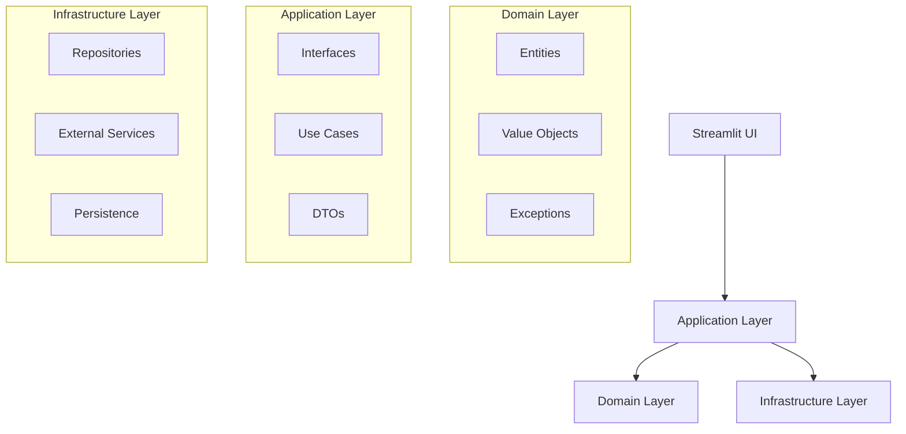

# Business Intelligence RAG System

A **next-generation Business Intelligence platform** that combines structured data analysis with advanced RAG (Retrieval-Augmented Generation) capabilities. Built with **Clean Architecture**, **Domain-Driven Design**, and **enterprise-grade patterns** for scalable financial analysis and document intelligence.

## 🎯 Core Features

### 📊 Advanced Financial Analytics
- **Smart CSV Processing** with Italian number format support (`1.234,56`)
- **Automated Financial Modeling** (YoY growth, ratios, KPIs)
- **Anomaly Detection** with statistical algorithms
- **Multi-Currency Support** with conversion tracking
- **Interactive Dashboards** with real-time visualizations
- **Comparative Analysis** across multiple periods and entities

### 🧠 RAG-Powered Document Intelligence  
- **Multi-Format Support** (PDF, DOCX, TXT, Markdown, Excel)
- **Semantic Search** with Qdrant vector database
- **Context-Aware Queries** combining structured and unstructured data
- **Metadata Extraction** with provenance tracking
- **PDF Export** of Q&A sessions for compliance
- **Intelligent Chunking** with overlap optimization

### 🤖 AI-Driven Business Intelligence
- **Executive Reporting** with strategic insights
- **Predictive Analytics** using historical patterns
- **Risk Assessment** with confidence scoring
- **Natural Language Queries** in Italian and English
- **Automated Recommendations** with priority levels
- **Trend Analysis** with statistical significance

### 💼 Enterprise-Ready Architecture
- **Clean Architecture** with domain separation
- **Repository Pattern** with SQLite persistence
- **Dependency Injection** container
- **Comprehensive Logging** with sensitive data filtering
- **Type Safety** with full MyPy compliance
- **Error Handling** with structured exceptions

## 🏗️ Architecture Overview

### System Design
The application follows **Clean Architecture** principles with clear layer separation:



### Technology Stack

| Layer | Component | Technology | Purpose |
|-------|-----------|------------|---------|
| **Presentation** | UI Framework | Streamlit 1.29+ | Web interface |
| **Application** | Business Logic | Python 3.10+ | Use cases & interfaces |
| **Domain** | Core Models | Pydantic 2.0+ | Entities & value objects |
| **Infrastructure** | Vector DB | Qdrant 1.7+ | Semantic search |
| | LLM Service | OpenAI GPT-4 | AI reasoning |
| | Data Processing | Pandas 2.1+ | CSV analysis |
| | Persistence | SQLite | Repository storage |
| | Visualization | Plotly 5.18+ | Interactive charts |
| **DevOps** | Package Manager | uv | Fast dependencies |
| | Linting | Ruff + Black | Code quality |
| | Type Checking | MyPy | Type safety |
| | Testing | Pytest | Quality assurance |

## Prerequisites

- **Python 3.10+**
- **OpenAI API Key** (required for LLM and embeddings)
- **Docker + Docker Compose** (optional, for containerized deployment)
- **8GB+ RAM** (recommended for vector operations)

## Installation

### Option 1: Quick Start (Recommended)

```bash
# 1. Clone repository
git clone <repository-url>
cd RAG

# 2. Configure environment
cp .env.example .env
# Edit .env and add your OPENAI_API_KEY

# 3. Automatic startup (installs uv if missing)
start.bat      # Windows  
./start.sh     # Linux/Mac

# 4. Open browser: http://localhost:8501
```

### Option 2: Manual Setup with uv

```bash
# Install uv (if not present)
curl -LsSf https://astral.sh/uv/install.sh | sh  # Linux/Mac
powershell -c "irm https://astral.sh/uv/install.ps1 | iex"  # Windows

# Setup environment
uv venv                              # Create virtual environment
source .venv/bin/activate           # Linux/Mac
.venv\Scripts\activate              # Windows

# Install dependencies (10-100x faster than pip)
uv pip install -r requirements.txt

# Start Qdrant
docker run -p 6333:6333 -p 6334:6334 qdrant/qdrant

# Start application
streamlit run app.py
```

### Option 3: Docker Deployment

```bash
# Complete setup with one command
cp .env.example .env  # Add OPENAI_API_KEY
docker-compose up -d

# Access app: http://localhost:8501
# Qdrant UI: http://localhost:6333/dashboard
```

## Configuration

### Environment Variables (.env)

```env
# OpenAI (Required)
OPENAI_API_KEY=sk-...your-key-here...

# Qdrant Vector Database
QDRANT_HOST=localhost
QDRANT_PORT=6333
QDRANT_COLLECTION_NAME=business_documents

# AI Configuration
LLM_MODEL=gpt-4-turbo-preview
EMBEDDING_MODEL=text-embedding-3-small
TEMPERATURE=0.7
MAX_TOKENS=2000

# Document Processing
CHUNK_SIZE=512
CHUNK_OVERLAP=50

# Application
DEBUG_MODE=false
APP_NAME=Business Intelligence RAG System
```

## 📁 Project Structure

```
src/
├── domain/                    # Core business logic (entities, value objects)
│   ├── entities/             # Business entities (FinancialData, Document, AnalysisResult)
│   ├── value_objects/        # Immutable values (Money, Percentage, DateRange)
│   └── exceptions/           # Domain-specific exceptions
├── application/              # Use cases and interfaces
│   └── interfaces/           # Contracts for external dependencies
├── infrastructure/           # External concerns (databases, APIs)
│   └── repositories/         # Data persistence implementations
├── core/                     # Cross-cutting concerns
│   ├── config.py            # Configuration management
│   ├── logging_config.py    # Structured logging
│   └── dependency_injection.py # DI container
└── presentation/             # UI layer (Streamlit)
    └── streamlit/

tests/
├── unit/                     # Unit tests for domain logic
├── integration/              # Integration tests for repositories
└── e2e/                     # End-to-end workflow tests
```

## 🚀 Usage Guide

### 1. 📊 Financial Data Analysis

**Enterprise-Grade CSV Processing:**
1. **Smart Upload**: Auto-detects Italian formats (`1.234,56`, date formats)
2. **Financial Modeling**: Automatic KPI calculation and trend analysis
3. **Advanced Analytics**:
   - YoY growth with statistical significance
   - Financial ratios and margin analysis
   - Anomaly detection with confidence scores
   - Multi-period comparative analysis
4. **Interactive Visualizations**: Plotly dashboards with drill-down capabilities

### 2. 🔍 RAG Document Intelligence

**Semantic Document Processing:**
1. **Multi-Format Ingestion**: PDF, DOCX, TXT, Markdown with metadata extraction
2. **Intelligent Indexing**: Context-aware chunking with Qdrant vector storage
3. **Natural Language Queries**: Ask complex questions in Italian or English
4. **Context Integration**: Combines financial data insights with document content
5. ****NEW**: PDF Export** - Export Q&A sessions with professional formatting

### 3. 🤖 AI-Powered Business Intelligence

**Strategic Decision Support:**
- **Executive Dashboards**: C-suite ready reports with key insights
- **Predictive Analytics**: Trend forecasting with confidence intervals  
- **Risk Assessment**: Automated risk scoring with mitigation strategies
- **Compliance Reporting**: Audit-ready documentation with provenance tracking
- **Multi-Language Support**: Italian and English query processing

## 🛠️ Development

### Quality Assurance

```bash
# Code Quality
ruff check .                       # Fast linting with 800+ rules
black .                           # Consistent code formatting  
mypy src/                         # Type checking
bandit src/                       # Security scanning

# Testing Suite  
pytest                            # Run all tests (80% coverage target)
pytest -m unit                   # Unit tests only
pytest -m integration            # Integration tests  
pytest -v --tb=short            # Verbose output

# Performance Testing
pytest -m slow                   # Performance benchmarks
pytest --cov=src --cov-report=html  # Coverage report
```

### Dependency Management

```bash
# Fast dependency management with uv (10-100x faster than pip)
uv add package-name               # Add production dependency
uv add --dev package-name         # Add development dependency
uv remove package-name            # Remove dependency
uv pip compile requirements.txt   # Update lockfile
uv sync                          # Sync environment
```

### Architecture Validation

```bash
# Domain Model Validation
python -m src.domain.entities.financial_data  # Test entity integrity
python -m src.domain.value_objects.money     # Test value objects

# Repository Testing  
python -m src.infrastructure.repositories    # Test data persistence

# Dependency Injection Validation
python -m src.core.dependency_injection      # Test DI container
```

## Troubleshooting

### Common Issues

#### OpenAI API Errors
```bash
# Invalid API key
export OPENAI_API_KEY=sk-your-key-here
# Or edit .env file

# Rate limit exceeded  
# Solution: Reduce request frequency or upgrade plan
```

#### Qdrant Connection Issues
```bash
# Check Qdrant status
curl http://localhost:6333/health

# Restart Qdrant
docker restart qdrant
```

#### Memory Issues
```bash
# Reduce chunk size
CHUNK_SIZE=256  # Default: 512

# Increase Docker memory
docker-compose up --memory=4g
```

## Contributing

1. **Fork** the repository
2. **Create feature branch**: `git checkout -b feature/amazing-feature`
3. **Commit changes**: `git commit -m 'Add amazing feature'`
4. **Push to branch**: `git push origin feature/amazing-feature`
5. **Open Pull Request**

## License

This project is released under the **MIT License** - see [LICENSE](LICENSE) for details.

## Support

- **Issues**: GitHub Issues for bug reports
- **Discussions**: GitHub Discussions for Q&A
- **Documentation**: Complete wiki on GitHub

---

**Ready to transform your data into business intelligence? Start now with a simple `start.bat`!**