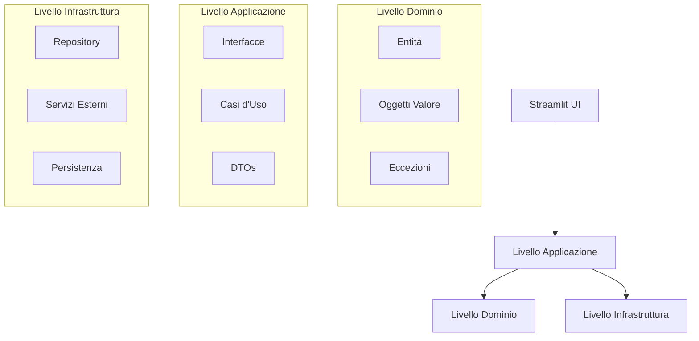

# Sistema RAG di Business Intelligence 🏢

Una **piattaforma di Business Intelligence aziendale di nuova generazione** che combina l'analisi di dati strutturati con funzionalità avanzate RAG (Retrieval-Augmented Generation). Costruita con **Clean Architecture**, **Domain-Driven Design**, e **pattern di livello enterprise** per analisi finanziarie scalabili e intelligenza documentale.

## 🎯 Funzionalità Principali

### 🚀 **NOVITÀ: Modalità Enterprise**
- **🔧 Attivazione Enterprise**: Attivazione con un clic nella barra laterale di Streamlit
- **📊 Riferimenti di Origine**: Tracciamento completo della provenienza dei dati
- **✅ Controlli Finanziari**: Validazione automatica di bilanci e PFN
- **🤖 Recupero Ibrido**: BM25 + Embeddings + Riclassificazione con cross-encoder
- **🧠 Mappatura Ontologia**: 31 metriche canoniche con oltre 219 sinonimi (Italiano/Inglese)
- **🗄️ Tabella Dimensionale**: Schema a stella con persistenza DuckDB/SQLite
- **⚡ Orchestrazione Enterprise**: Flusso di lavoro integrato con pipeline a 6 fasi

### 📊 Analisi Finanziarie Avanzate
- **Elaborazione CSV Intelligente** con supporto per formati numerici italiani (`1.234,56`)
- **Modellazione Finanziaria Automatizzata** (crescita YoY, rapporti, KPI)
- **Rilevamento Anomalie** con algoritmi statistici
- **Supporto Multi-Valuta** con tracciamento delle conversioni
- **Dashboard Interattive** con visualizzazioni in tempo reale
- **Analisi Comparativa** tra più periodi ed entità

### 🧠 Intelligenza Documentale Basata su RAG  
- **Supporto Multi-Formato** (PDF, DOCX, TXT, Markdown, Excel)
- **Ricerca Semantica** con database vettoriale Qdrant
- **Query Context-Aware** che combinano dati strutturati e non strutturati
- **Estrazione Metadati** con tracciamento della provenienza
- **Export PDF Professionale** con stile ZCS Company
- **Chunking Intelligente** con ottimizzazione delle sovrapposizioni

### 🤖 Business Intelligence Guidata dall'AI
- **Report Esecutivi** con insight strategici
- **Analisi Predittive** basate su pattern storici
- **Valutazione del Rischio** con punteggi di confidenza
- **Query in Linguaggio Naturale** in italiano e inglese
- **Raccomandazioni Automatiche** con livelli di priorità
- **Analisi dei Trend** con significatività statistica

### 💼 Architettura Enterprise-Ready
- **Clean Architecture** con separazione dei domini
- **Pattern Repository** con persistenza SQLite/DuckDB
- **Dependency Injection** container
- **Logging Completo** con filtraggio dei dati sensibili
- **Type Safety** con piena conformità MyPy
- **Gestione Errori** con eccezioni strutturate
- **Degradazione Graduale** per componenti enterprise opzionali

## 🏗️ Panoramica dell'Architettura

### Progettazione del Sistema
L'applicazione segue i principi della **Clean Architecture** con una chiara separazione dei livelli:



### Stack Tecnologico Enterprise

| Livello | Componente | Tecnologia | Scopo |
|---------|------------|------------|--------|
| **Presentazione** | Framework UI | Streamlit 1.29+ | Interfaccia web con modalità Enterprise |
| **Applicazione** | Logica di Business | Python 3.10+ | Casi d'uso e interfacce |
| | **Orchestratore Enterprise** | **Pipeline Personalizzata** | **Flusso di lavoro a 6 fasi** |
| | **Router Documenti** | **Classificazione Contenuti** | **Routing Strutturato/Non Strutturato** |
| | **Recupero Ibrido** | **BM25 + Embeddings** | **Ricerca avanzata con riclassificazione** |
| **Dominio** | Modelli Core | Pydantic 2.0+ | Entità e oggetti valore |
| | **Riferimenti Origine** | **Tracciamento Provenienza** | **Lineage completo dei dati** |
| | **Controlli Finanziari** | **Regole di Validazione** | **Verifiche coerenza bilancio** |
| **Infrastruttura** | Database Vettoriale | Qdrant 1.7+ | Ricerca semantica |
| | **Tabella Fatti** | **DuckDB/SQLite** | **Data warehouse dimensionale** |
| | Servizio LLM | OpenAI GPT-4 | Ragionamento AI |
| | **Mappatura Ontologia** | **YAML + RapidFuzz** | **31 metriche, oltre 219 sinonimi** |
| | **Normalizzazione Dati** | **Supporto Multi-locale** | **Formati e periodi italiani** |
| | Elaborazione Dati | Pandas 2.1+ | Analisi CSV |
| | Visualizzazione | Plotly 5.18+ | Grafici interattivi |
| **ML/AI** | **Embeddings** | **SentenceTransformers** | **Modello All-MiniLM-L6-v2** |
| | **Reranker** | **CrossEncoder** | **MS-MARCO-MiniLM-L-2-v2** |
| | **Ricerca** | **BM25Okapi** | **Recupero basato su parole chiave** |
| **DevOps** | Package Manager | uv | Dipendenze veloci |
| | Linting | Ruff + Black | Qualità del codice |
| | Controllo Tipi | MyPy | Sicurezza dei tipi |
| | Testing | Pytest | Garanzia qualità |

## Prerequisiti

- **Python 3.10+**
- **Chiave API OpenAI** (richiesta per LLM ed embeddings)
- **Docker + Docker Compose** (opzionale, per deployment containerizzato)
- **8GB+ RAM** (raccomandato per operazioni vettoriali)
- **Tesseract OCR** (richiesto per estrazione testo PDF e funzionalità OCR)

## Installazione

### Opzione 1: Avvio Rapido (Raccomandato)

```bash
# 1. Clona il repository
git clone <repository-url>
cd RAG

# 2. Configura l'ambiente
cp .env.example .env
# Modifica .env e aggiungi la tua OPENAI_API_KEY

# 3. Avvio automatico (installa uv se mancante)
start.bat      # Windows  
./start.sh     # Linux/Mac

# 4. Apri il browser: http://localhost:8501
```

### Opzione 2: Configurazione Manuale con uv

```bash
# Installa uv (se non presente)
curl -LsSf https://astral.sh/uv/install.sh | sh  # Linux/Mac
powershell -c "irm https://astral.sh/uv/install.ps1 | iex"  # Windows

# Configura l'ambiente
uv venv                              # Crea ambiente virtuale
source .venv/bin/activate           # Linux/Mac
.venv\Scripts\activate              # Windows

# Installa le dipendenze (10-100x più veloce di pip)
uv pip install -r requirements.txt

# Avvia Qdrant
docker run -p 6333:6333 -p 6334:6334 qdrant/qdrant

# Avvia l'applicazione
streamlit run app.py
```

### Opzione 3: Deployment Docker

```bash
# Configurazione completa con un comando
cp .env.example .env  # Aggiungi OPENAI_API_KEY
docker-compose up -d

# Accedi all'app: http://localhost:8501
# UI Qdrant: http://localhost:6333/dashboard
```

### Installazione Dipendenze OCR

L'applicazione richiede **Tesseract OCR** per l'estrazione di testo dai PDF e la funzionalità OCR.

#### Installazione Windows

**Opzione 1: Utilizzo di Windows Package Manager (Raccomandato)**
```bash
# Installa usando winget (Windows 10+)
winget install --id UB-Mannheim.TesseractOCR

# Verifica l'installazione
tesseract --version
```

**Opzione 2: Installazione Manuale**
1. Scarica l'installer più recente di Tesseract da [UB Mannheim](https://github.com/UB-Mannheim/tesseract/releases)
2. Esegui l'installer (`tesseract-ocr-w64-setup-5.x.x.exe`)
3. Assicurati di selezionare "Aggiungi al PATH" durante l'installazione
4. Riavvia il terminale/prompt dei comandi
5. Verifica: `tesseract --version`

**Se Tesseract non è nel PATH:**
```bash
# Aggiungi alla sessione corrente (temporaneo)
set PATH=C:\Program Files\Tesseract-OCR;%PATH%

# Oppure aggiungi permanentemente C:\Program Files\Tesseract-OCR al PATH di sistema
```

#### Installazione Linux
```bash
# Ubuntu/Debian
sudo apt update && sudo apt install tesseract-ocr

# CentOS/RHEL/Fedora
sudo yum install tesseract  # oppure sudo dnf install tesseract

# Verifica
tesseract --version
```

#### Installazione macOS
```bash
# Usando Homebrew
brew install tesseract

# Verifica
tesseract --version
```

**Nota:** Se Tesseract non è installato, l'applicazione mostrerà un avviso e la funzionalità OCR sarà disabilitata, ma le altre funzionalità continueranno a funzionare.

## Configurazione

### Variabili d'Ambiente (.env)

```env
# OpenAI (Obbligatorio)
OPENAI_API_KEY=sk-...la-tua-chiave-qui...

# Database Vettoriale Qdrant
QDRANT_HOST=localhost
QDRANT_PORT=6333
QDRANT_COLLECTION_NAME=business_documents

# Configurazione AI
LLM_MODEL=gpt-4-turbo-preview
EMBEDDING_MODEL=text-embedding-3-small
TEMPERATURE=0.1
MAX_TOKENS=2000

# Elaborazione Documenti
CHUNK_SIZE=512
CHUNK_OVERLAP=50

# Performance RAG (NUOVO)
RAG_RESPONSE_MODE=compact
RAG_SIMILARITY_TOP_K=3
RAG_ENABLE_CACHING=True

# Funzionalità Enterprise (NUOVO)
HF_HUB_DISABLE_SYMLINKS_WARNING=1

# Applicazione
DEBUG_MODE=false
APP_NAME=Sistema RAG di Business Intelligence
```

## 📁 Struttura del Progetto Enterprise

```
src/
├── domain/                    # Logica di business principale (entità, oggetti valore)
│   ├── entities/             # Entità di business (FinancialData, Document, AnalysisResult)
│   ├── value_objects/        # NUOVO: Riferimenti origine, controlli, validazione
│   │   ├── source_reference.py    # Tracciamento completo provenienza dati
│   │   └── guardrails.py          # Regole di validazione finanziaria
│   └── exceptions/           # Eccezioni specifiche del dominio
├── application/              # Casi d'uso e interfacce  
│   ├── interfaces/           # Contratti per dipendenze esterne
│   └── services/             # NUOVO: Servizi applicativi enterprise
│       ├── enterprise_orchestrator.py  # Coordinatore principale del flusso
│       ├── document_router.py          # Classificazione documenti
│       ├── hybrid_retrieval.py         # Ricerca BM25 + Embeddings
│       ├── ontology_mapper.py          # Mappatura sinonimi metriche
│       └── data_normalizer.py          # Normalizzazione multi-locale
├── infrastructure/           # Aspetti esterni (database, API)
│   └── repositories/         # Implementazioni persistenza dati
│       └── fact_table_repository.py   # NUOVO: Data warehouse dimensionale
├── core/                     # Aspetti trasversali
│   ├── config.py            # Gestione configurazione
│   ├── logging_config.py    # Logging strutturato
│   └── dependency_injection.py # Container DI
├── presentation/             # Livello UI (Streamlit)
│   └── streamlit/
│       └── pdf_exporter.py   # NUOVO: Export PDF professionale (stile ZCS)
└── services/                 # Servizi legacy (in migrazione)
    ├── rag_engine.py        # Potenziato con orchestratore enterprise
    └── query_cache.py       # Ottimizzazione performance

config/
└── ontology/                 # NUOVO: Ontologia metriche finanziarie
    └── financial_metrics.yaml     # 31 metriche, oltre 219 sinonimi

tests/
├── unit/                     # Test unitari per logica dominio
├── integration/              # Test integrazione per repository
└── e2e/                     # Test end-to-end flussi lavoro
```

## 🚀 Guida all'Uso

### 🚀 **NUOVO: Utilizzo Modalità Enterprise**

**Attiva le Funzionalità Enterprise:**
1. **Attiva la Modalità Enterprise** nella barra laterale di Streamlit (🚀 Modalità Enterprise)
2. **Carica Documenti Finanziari** (PDF, Excel, Word)
3. **Poni Domande** - La pipeline Enterprise automaticamente:
   - Instradata i documenti (strutturati/non strutturati/ibridi)
   - Esegue recupero ibrido (BM25 + embeddings + riclassificazione)
   - Estrae e normalizza le metriche finanziarie
   - Mappa all'ontologia canonica (Italiano ↔ Inglese)
   - Valida la coerenza del bilancio
   - Archivia con piena provenienza nella tabella dimensionale

**I Risultati delle Query Enterprise Includono:**
- **📊 Metriche Rilevate**: Valori normalizzati con punteggi di confidenza
- **✅ Risultati di Validazione**: Controlli di coerenza (bilancio, PFN)
- **⚡ Statistiche di Elaborazione**: Tempo, confidenza, record salvati
- **🔍 Riferimenti di Origine**: Provenienza completa dei dati
- **⚠️ Avvisi di Validazione**: Incongruenze contabili segnalate

### 1. 📊 Analisi Dati Finanziari

**Elaborazione CSV di Livello Enterprise:**
1. **Upload Intelligente**: Rileva automaticamente i formati italiani (`1.234,56`, formati data)
2. **Modellazione Finanziaria**: Calcolo automatico di KPI e analisi dei trend
3. **Analisi Avanzate**:
   - Crescita YoY con significatività statistica
   - Rapporti finanziari e analisi dei margini
   - Rilevamento anomalie con punteggi di confidenza
   - Analisi comparative multi-periodo
4. **Visualizzazioni Interattive**: Dashboard Plotly con capacità di drill-down

### 2. 🔍 Intelligenza Documentale RAG

**Elaborazione Semantica dei Documenti:**
1. **Ingestione Multi-Formato**: PDF, DOCX, TXT, Markdown con estrazione metadati
2. **Indicizzazione Intelligente**: Chunking context-aware con archiviazione vettoriale Qdrant
3. **Query in Linguaggio Naturale**: Poni domande complesse in italiano o inglese
4. **Integrazione del Contesto**: Combina insights dei dati finanziari con il contenuto dei documenti
5. **Export PDF Professionale** - Esporta sessioni Q&A con stile ZCS Company

### 3. 🤖 Business Intelligence Basata su AI

**Supporto Decisionale Strategico:**
- **Dashboard Esecutive**: Report pronti per il C-suite con insight chiave
- **Analisi Predittive**: Previsioni sui trend con intervalli di confidenza  
- **Valutazione del Rischio**: Scoring automatico del rischio con strategie di mitigazione
- **Report di Conformità**: Documentazione pronta per audit con tracciamento provenienza
- **Supporto Multi-Lingua**: Elaborazione query in italiano e inglese

## 🛠️ Sviluppo

### Garanzia della Qualità

```bash
# Qualità del Codice
ruff check .                       # Linting veloce con oltre 800 regole
black .                           # Formattazione coerente del codice  
mypy src/                         # Controllo dei tipi
bandit src/                       # Scansione sicurezza

# Suite di Test  
pytest                            # Esegui tutti i test (obiettivo copertura 80%)
pytest -m unit                   # Solo test unitari
pytest -m integration            # Test di integrazione  
pytest -v --tb=short            # Output dettagliato

# Test delle Prestazioni
pytest -m slow                   # Benchmark delle prestazioni
pytest --cov=src --cov-report=html  # Report di copertura
```

### Gestione Dipendenze

```bash
# Gestione dipendenze veloce con uv (10-100x più veloce di pip)
uv add nome-pacchetto              # Aggiungi dipendenza di produzione
uv add --dev nome-pacchetto        # Aggiungi dipendenza di sviluppo
uv remove nome-pacchetto           # Rimuovi dipendenza
uv pip compile requirements.txt   # Aggiorna file di lock
uv sync                           # Sincronizza ambiente
```

### Architecture Validation

```bash
# Domain Model Validation
python -m src.domain.entities.financial_data  # Test entity integrity
python -m src.domain.value_objects.money     # Test value objects

# Repository Testing  
python -m src.infrastructure.repositories    # Test data persistence

# Dependency Injection Validation
python -m src.core.dependency_injection      # Test DI container
```

## Risoluzione Problemi

### Problemi Comuni

#### Errori API OpenAI
```bash
# Chiave API non valida
export OPENAI_API_KEY=sk-la-tua-chiave-qui
# Oppure modifica il file .env

# Limite di velocità superato  
# Soluzione: Riduci la frequenza delle richieste o aggiorna il piano
```

#### Problemi di Connessione Qdrant
```bash
# Controlla lo stato di Qdrant
curl http://localhost:6333/health

# Riavvia Qdrant
docker restart qdrant
```

#### Problemi di Memoria
```bash
# Riduci la dimensione del chunk
CHUNK_SIZE=256  # Default: 512

# Aumenta la memoria Docker
docker-compose up --memory=4g
```

## Contribuire

1. **Fork** del repository
2. **Crea branch feature**: `git checkout -b feature/funzionalita-incredibile`
3. **Commit delle modifiche**: `git commit -m 'Aggiungi funzionalità incredibile'`
4. **Push al branch**: `git push origin feature/funzionalita-incredibile`
5. **Apri Pull Request**

## Licenza

Questo progetto è rilasciato sotto la **Licenza MIT** - vedi [LICENSE](LICENSE) per i dettagli.

## Supporto

- **Problemi**: GitHub Issues per segnalazioni di bug
- **Discussioni**: GitHub Discussions per domande e risposte
- **Documentazione**: Wiki completa su GitHub

---

**Pronto a trasformare i tuoi dati in business intelligence? Inizia ora con un semplice `start.bat`!**